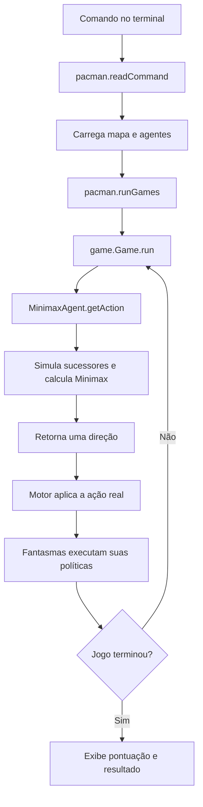

# Guia de estudo do código: Pac-Man com Minimax

**Membros:** Henrique Luza dos Santos e Eduardo Regueiro Costa.

**Disciplina:** Inteligência Artificial — Ciências da Computação.

**Professor:** Nikson Bernardes Fernandes Ferreira.

Este guia acompanha a implementação do repositório. A seção 5 explica **cada linha não vazia de `seuPacManAgents.py`**, inclusive imports, comentários e configurações. As demais seções explicam os arquivos do motor, os pontos de integração alterados, os testes e o raciocínio necessário para apresentar o trabalho. Os milhares de linhas da base recebida são organizados por responsabilidade e por métodos; não são uma segunda implementação do Minimax.

## Índice

1. [Ordem de estudo](#1-ordem-de-estudo)
2. [O problema e o modelo adversarial](#2-o-problema-e-o-modelo-adversarial)
3. [Fluxo do programa](#3-fluxo-do-programa)
4. [Uma árvore calculada à mão](#4-uma-árvore-calculada-à-mão)
5. [Arquivo de entrega linha por linha](#5-arquivo-de-entrega-linha-por-linha)
6. [Por que a recursão funciona](#6-por-que-a-recursão-funciona)
7. [Avaliação e pesos](#7-avaliação-e-pesos)
8. [O que cada arquivo faz](#8-o-que-cada-arquivo-faz)
9. [Integração e testes](#9-integração-e-testes)
10. [Como o projeto foi construído](#10-como-o-projeto-foi-construído)
11. [Depuração e exercícios](#11-depuração-e-exercícios)
12. [Roteiro de apresentação e perguntas](#12-roteiro-de-apresentação-e-perguntas)

## 1. Ordem de estudo

1. Execute uma partida com `--depth 1` e `-t` para observar os turnos.
2. Leia as seções 2 a 4 e calcule o exemplo manualmente.
3. Abra `seuPacManAgents.py` ao lado da seção 5.
4. Acompanhe `GameState.generateSuccessor` em `pacman.py` e `Game.run` em `game.py`.
5. Leia os testes: eles apresentam situações pequenas com resposta verificável.
6. Execute `python3 scripts/validar_minimax.py` e interprete o resultado.
7. Explique oralmente a diferença entre algoritmo, avaliação e política real dos fantasmas.

Não tente decorar o motor inteiro antes de entender a decisão. Comece pelo contrato: **entra um estado do jogo; sai uma ação**. Depois acompanhe os métodos que sustentam esse contrato.

### Vocabulário Python necessário

| Construção | Significado neste projeto |
| --- | --- |
| `class` | Define um tipo de objeto, como um agente. |
| Herança em `class A(B)` | `A` aproveita o comportamento já definido em `B`. |
| `self` | Referência à instância atual; guarda índice, profundidade e avaliação. |
| `__init__` | Inicializa a instância quando `MinimaxAgent(...)` é chamado. |
| `super()` | Acessa a implementação da classe base. |
| Função aninhada | Função definida dentro de outra; `minimax` acessa `self` do escopo externo. |
| Recursão | Uma função chama a si própria para resolver problemas menores. |
| `return` | Encerra a chamada atual e entrega um resultado a quem chamou. |
| `for` | Visita cada elemento, aqui cada ação legal ou cada fantasma. |
| `if not lista` | Verifica se a lista está vazia. |
| `%` | Resto de divisão: permite voltar ao agente 0. |
| `x if condição else y` | Expressão condicional que produz um valor. |
| `float("inf")` | Infinito positivo; com sinal negativo, infinito negativo. |
| `: GameState` | Anotação de tipo; documenta o argumento sem validar seu tipo em execução. |
| `fn = outra_funcao` | Guarda a própria função para chamá-la depois. Não executa a função. |
| `min(expr for item in itens)` | Calcula o menor valor produzido por uma expressão geradora. |
| Docstring | Texto entre aspas triplas que documenta módulo, classe ou função. |

## 2. O problema e o modelo adversarial

O estado contém posições, paredes, comida, cápsulas, temporizadores, pontuação e indicadores de vitória/derrota. Uma ação é uma direção: `North`, `South`, `East`, `West` ou `Stop`, sujeita às regras do agente.

O Pac-Man não recebe a sequência futura dos fantasmas. Ele enumera possibilidades e pergunta: **se eu fizer este movimento e os fantasmas escolherem as piores respostas para mim, qual será o resultado estimado?** Entre esses piores resultados, escolhe o maior.

- **MAX:** o Pac-Man, índice 0, tenta aumentar a avaliação.
- **MIN:** fantasmas, índices 1 até `getNumAgents() - 1`, tentam diminuí-la.
- **Folha:** estado em que a busca para e chama a avaliação.
- **Raiz:** estado real entregue ao agente para decidir agora.
- **Sucessor:** cópia que representa o efeito de uma ação simulada.
- **Profundidade:** número de rodadas completas de Pac-Man e todos os fantasmas.

A modelagem trata os fantasmas como um lado adversário com o mesmo objetivo. Não significa que o motor distribua literalmente a pontuação perdida pelo Pac-Man aos fantasmas. É uma utilidade usada para decidir.

O motor real usa políticas próprias. `RandomGhost` sorteia ações; `DirectionalGhost` favorece aproximação quando ativo e afastamento quando assustado. O Minimax é conservador: raciocina como se cada fantasma escolhesse a pior resposta, independentemente da política usada na execução.

### Contrato matemático

Chamemos de `V(s, i, d)` o valor do estado `s`, com o agente `i` prestes a jogar e `d` rodadas concluídas.

```text
Se s é terminal, d >= limite ou não há ações:
    V(s, i, d) = avaliação(s)

Se i == 0:
    V(s, i, d) = máximo dos valores dos sucessores

Se i > 0:
    V(s, i, d) = mínimo dos valores dos sucessores
```

A ação da raiz é a que atinge o maior desses valores. A avaliação é sempre vista da perspectiva do Pac-Man; não trocamos o sinal da pontuação ao visitar um fantasma.

### Uma rodada com dois fantasmas

| Estado da chamada | Agente que vai agir | Profundidade |
| --- | --- | ---: |
| Raiz | Pac-Man (0) | 0 |
| Depois do Pac-Man | Fantasma 1 | 0 |
| Depois do fantasma 1 | Fantasma 2 | 0 |
| Depois do fantasma 2 | Pac-Man (0) | 1 |

Com limite 1, a quarta linha é uma folha: avaliamos o estado antes de mover o Pac-Man novamente. Com limite 2, começamos outra rodada completa.

O rascunho do material contém um comentário ambíguo sobre incrementar no Pac-Man. A explicação detalhada do enunciado exige incrementar depois do último fantasma. O código segue essa definição de rodada completa.

## 3. Fluxo do programa



Ao simular mil sucessores, o agente **não executa mil movimentos reais**. Ele explora cópias e retorna uma direção. Só depois o motor modifica o estado real da partida. Na decisão seguinte, a árvore é construída novamente a partir da nova observação; não mantemos uma árvore entre turnos.

`GameState.generateSuccessor` cria um novo estado, aplica movimento, consumo, penalidade temporal e colisões. A comida usa cópia quando precisa ser alterada. A posição e a pontuação do estado de entrada são preservadas. Há, porém, instrumentação global de estados explorados na base; ela serve ao corretor e não representa movimentação real no tabuleiro.

## 4. Uma árvore calculada à mão

Considere profundidade 1 e um fantasma:

```text
                     Pac-Man: MAX
                    /             \
                 risco            seguro
                 MIN               MIN
               /     \           /     \
             100     -10         3       5
```

1. Na ação `risco`, o fantasma escolhe `min(100, -10) = -10`.
2. Na ação `seguro`, o fantasma escolhe `min(3, 5) = 3`.
3. O Pac-Man escolhe `max(-10, 3) = 3` e retorna `seguro`.

A folha 100 é tentadora, mas depende de uma resposta favorável do adversário. O Minimax protege o melhor resultado que pode garantir **dentro da árvore e da avaliação consideradas**.

### Rastreamento das chamadas

| Etapa | Operação | Valor devolvido |
| --- | --- | ---: |
| 1 | Raiz gera sucessor `risco` | Estado, ainda sem valor |
| 2 | `minimax(risco, 1, 0)` visita primeira resposta | 100 |
| 3 | Mesma chamada visita segunda resposta | -10 |
| 4 | Nó MIN de `risco` termina | -10 |
| 5 | Raiz guarda `risco` como melhor por enquanto | -10 |
| 6 | `minimax(seguro, 1, 0)` visita as respostas | 3 e 5 |
| 7 | Nó MIN de `seguro` termina | 3 |
| 8 | Raiz compara `3 > -10` e substitui a ação | `seguro` |

Cada chamada tem suas próprias variáveis locais `best_value`, `legal_actions` e `state`. O `best_value` de um fantasma não é o mesmo objeto de controle da raiz. Quando a recursão retorna, a execução continua na linha seguinte à chamada que estava aguardando.

### Dois fantasmas

Depois de MAX há MIN do fantasma 1 e MIN do fantasma 2. Não devemos alternar MAX/MIN usando a paridade da profundidade: os dois fantasmas minimizam consecutivamente. Só o índice do agente identifica quem maximiza.

## 5. Arquivo de entrega linha por linha

As referências abaixo correspondem à versão entregue, com 121 linhas. Linhas em branco apenas separam blocos. Para conferir os números em sistemas Unix:

```bash
nl -ba seuPacManAgents.py
```

### Cabeçalho, imports e construção

| Linha | Código ou trecho | Explicação |
| ---: | --- | --- |
| 1 | `# seuPacManAgents.py` | Identifica o arquivo exigido para entrega. |
| 2 | Separador comentado | Apenas organização visual. |
| 3 | `Licensing Information...` | Inicia o aviso original da base. |
| 4 | `educational purposes...` | Registra a condição educacional e a restrição de distribuição. |
| 5 | `solutions...retain this notice...` | Mantém as condições do material recebido. |
| 6 | `attribution to UC Berkeley...` | Preserva a atribuição e o endereço fornecido pela base. |
| 7 | `#` | Separação dentro do comentário de licença. |
| 8 | `Attribution Information...` | Identifica a origem dos projetos Pac-Man. |
| 9 | `core projects and autograders...` | Inicia os créditos dos desenvolvedores originais. |
| 10 | Nomes e contatos | Completa os créditos a John DeNero e Dan Klein. |
| 11 | `Student side autograding...` | Credita a implementação do corretor estudantil. |
| 12 | `Pieter Abbeel...` | Completa os créditos originais. |
| 15 | Abertura da docstring | Explica o propósito acadêmico do módulo. |
| 17 | `Membros: ...` | Identifica Henrique Luza dos Santos e Eduardo Regueiro Costa. |
| 18 | Fechamento de aspas triplas | Encerra a docstring; ela não altera decisões do agente. |
| 20 | `from game import Directions` | Importa constantes das ações, inclusive `STOP`. |
| 21 | `from multiAgents import MultiAgentSearchAgent` | Importa a classe que configura os agentes de busca. |
| 22 | `from pacman import GameState` | Importa o tipo usado na anotação do estado. |
| 23 | `from util import manhattanDistance` | Importa a medida de distância utilizada apenas na heurística opcional. |
| 26 | `class MinimaxAgent(MultiAgentSearchAgent):` | Declara o agente com a herança exigida. |
| 27 | Docstring da classe | Resume o papel de MAX e MIN. |
| 29 | `def __init__(self, evalFn=..., depth="3"):` | Define opções compatíveis com os argumentos textuais do motor. |
| 30 | Comentário da classe base | Explica os atributos que serão inicializados. |
| 31 | `super().__init__(depth=depth)` | Define `index=0`, avaliação padrão e `self.depth=int(depth)`. |
| 32 | `if self.depth < 1:` | Evita profundidades que não permitiriam simular uma rodada. |
| 33 | `raise ValueError(...)` | Interrompe a construção com mensagem clara para valores menores que 1. |
| 34 | `if evalFn in (...)` | Reconhece os dois nomes locais da heurística opcional. |
| 35 | `self.evaluationFunction = betterEvaluationFunction` | Guarda a função para usá-la nas folhas. Não a chama agora. |
| 36 | `elif evalFn != "scoreEvaluationFunction":` | Se não é o padrão nem um apelido local, tenta a resolução da base. |
| 37 | Comentário de compatibilidade | Explica o caso de nomes como `seuPacManAgents.betterEvaluationFunction`. |
| 38 | `super().__init__(evalFn=evalFn, depth=depth)` | Reconfigura a avaliação usando `util.lookup`; um nome inexistente gera erro. |

Por que não apenas herdar o construtor? A base resolve nomes no módulo `multiAgents`, que contém outra função chamada `betterEvaluationFunction`. Nosso construtor garante que `evalFn=better` selecione a função corrigida **do arquivo de entrega**, mesmo quando apenas esse arquivo é copiado para a base original. O padrão continua sendo a pontuação do motor.

### Função recursiva

| Linha | Código ou trecho | Explicação |
| ---: | --- | --- |
| 40 | `def getAction(self, gameState: GameState):` | Método que o motor chama para obter a direção do Pac-Man. |
| 41 | Docstring do método | Define profundidade em rodadas, não em movimentos isolados. |
| 43 | `def minimax(state, agent_index, depth):` | Define a função local que sempre devolve um valor numérico. |
| 44 | Comentário das folhas | Explica por que o caso base vem antes da geração de sucessores. |
| 45 | `if state.isWin() or state.isLose() or depth >= self.depth:` | Para por vitória, derrota ou limite de rodadas. `or` usa curto-circuito. |
| 46 | `return self.evaluationFunction(state)` | Mede a qualidade do estado e encerra essa chamada. |
| 48 | `legal_actions = state.getLegalActions(agent_index)` | Obtém somente movimentos permitidos para o agente atual. |
| 49 | `if not legal_actions:` | Detecta um agente sem ações disponíveis. |
| 50 | `return self.evaluationFunction(state)` | Trata o nó bloqueado como folha; não inventa um movimento. |
| 52 | `next_agent = (agent_index + 1) % state.getNumAgents()` | Avança um índice e volta a zero após o último agente. |
| 53 | `next_depth = depth + (1 if next_agent == self.index else 0)` | Soma uma rodada apenas ao voltar ao Pac-Man. |
| 55 | `if agent_index == self.index:` | Decide se este é um nó MAX; `self.index` vale zero. |
| 56 | `best_value = -float("inf")` | Começa abaixo de qualquer pontuação finita para buscar um máximo. |
| 57 | `for action in legal_actions:` | Enumera todas as opções do Pac-Man na ordem fornecida. |
| 58 | `successor = state.generateSuccessor(agent_index, action)` | Simula o movimento em um novo estado. |
| 59 | `value = minimax(successor, next_agent, next_depth)` | Resolve a subárvore e aguarda seu valor. |
| 60 | `best_value = max(best_value, value)` | Conserva o maior resultado encontrado até agora. |
| 61 | `return best_value` | Retorna o valor MAX depois de visitar todas as ações. |
| 63 | `best_value = float("inf")` | Como o bloco MAX já retornaria, daqui em diante estamos em MIN. |
| 64 | `for action in legal_actions:` | Enumera as respostas do fantasma atual. |
| 65 | `successor = state.generateSuccessor(agent_index, action)` | Simula o movimento desse fantasma. |
| 66 | `value = minimax(successor, next_agent, next_depth)` | Consulta a próxima camada, que pode ser outro fantasma. |
| 67 | `best_value = min(best_value, value)` | Conserva o pior valor para o Pac-Man. |
| 68 | `return best_value` | Devolve esse mínimo ao nó pai; a direção do fantasma não é necessária. |

Com três agentes, `% 3` transforma `1` em `1`, `2` em `2` e `3` em `0` ao calcular o próximo índice. Com apenas Pac-Man, `% 1` sempre resulta em zero: cada ação do Pac-Man completa uma rodada.

### Escolha da ação na raiz

| Linha | Código ou trecho | Explicação |
| ---: | --- | --- |
| 70 | Comentário da raiz | Distingue o retorno público (ação) do retorno recursivo (valor). |
| 71 | `if gameState.isWin() or gameState.isLose():` | Evita iniciar uma busca quando a partida já terminou. |
| 72 | `return Directions.STOP` | Retorno defensivo; o motor normalmente não pede ação após o fim. |
| 73 | `legal_actions = gameState.getLegalActions(self.index)` | Solicita os movimentos reais disponíveis ao Pac-Man. |
| 74 | `if not legal_actions:` | Detecta ausência de movimentos na raiz. |
| 75 | `return Directions.STOP` | Sentinela defensiva; não significa que `STOP` seja legal em um estado arbitrário sem ações. |
| 77 | `best_action = legal_actions[0]` | Garante uma ação legal mesmo se todos os valores forem `-inf`. |
| 78 | `best_value = -float("inf")` | Inicializa o valor da melhor ação da raiz. |
| 79 | `next_agent = (self.index + 1) % gameState.getNumAgents()` | Define quem age depois do primeiro movimento do Pac-Man. |
| 80 | `next_depth = 1 if next_agent == self.index else 0` | Com fantasmas ainda estamos na rodada zero; sem fantasmas, já completamos uma rodada. |
| 81 | `for action in legal_actions:` | Testa todas as ações candidatas da raiz, inclusive `Stop`. |
| 82 | `successor = gameState.generateSuccessor(self.index, action)` | Gera o estado resultante da candidata. |
| 83 | `value = minimax(successor, next_agent, next_depth)` | Calcula o valor que os adversários permitem nessa alternativa. |
| 84 | Comentário de desempate | Registra a decisão de manter a primeira ação com maior valor. |
| 85 | `if value > best_value:` | Só troca a ação em melhoria estrita; igualdade não troca. |
| 86 | `best_value = value` | Atualiza o valor de referência. |
| 87 | `best_action = action` | Guarda a ação correspondente ao novo maior valor. |
| 88 | `return best_action` | Entrega uma direção ao motor, e não a pontuação. |

A raiz está separada para evitar uma função recursiva que às vezes retorna `str` e às vezes retorna número. O princípio do enunciado permanece: MAX na raiz, valores propagados nas subárvores e uma direção devolvida por `getAction`.

### Heurística opcional

| Linha | Código ou trecho | Explicação |
| ---: | --- | --- |
| 91 | `def betterEvaluationFunction(currentGameState: GameState):` | Define uma estimativa de qualidade para a busca com horizonte limitado. |
| 92 | Docstring | Lista os sinais utilizados na avaliação. |
| 93 | `if currentGameState.isWin():` | Prioriza o reconhecimento de vitória. |
| 94 | `return float("inf")` | Vitória supera todos os estados não terminais. |
| 95 | `if currentGameState.isLose():` | Identifica uma derrota já ocorrida. |
| 96 | `return -float("inf")` | Derrota fica abaixo dos estados não terminais. |
| 98 | `position = currentGameState.getPacmanPosition()` | Lê as coordenadas atuais do Pac-Man. |
| 99 | `food = currentGameState.getFood().asList()` | Converte a grade de comida em coordenadas dos pontos restantes. |
| 100 | `capsules = currentGameState.getCapsules()` | Lê as posições das cápsulas ainda disponíveis. |
| 101 | `value = ...getScore() - 4 * len(food) - 3 * len(capsules)` | Parte da pontuação e penaliza objetivos ainda não consumidos. |
| 103 | `if food:` | Evita calcular `min` de uma sequência vazia. |
| 104 | `nearest_food = min(...)` | Obtém a menor distância de Manhattan até uma comida. |
| 105 | `value += 10 / (nearest_food + 1)` | Premia proximidade; o `+1` impede divisão por zero. |
| 107 | `for ghost in ...getGhostStates():` | Avalia cada fantasma separadamente; nenhum `min` sobre lista vazia. |
| 108 | `distance = manhattanDistance(...)` | Estima distância até esse fantasma, ignorando paredes. |
| 109 | `if ghost.scaredTimer > distance:` | Identifica uma oportunidade aproximada de alcançá-lo enquanto assustado. |
| 110 | Comentário do temporizador | Explica que a atração depende da distância estimada. |
| 111 | `value += 20 / (distance + 1)` | Premia a proximidade do fantasma vulnerável. |
| 112 | `elif ghost.scaredTimer == 0:` | Trata fantasmas ativos como perigosos. |
| 113 | `value -= 12 / (distance + 1)` | A proximidade de perigo reduz a avaliação. |
| 114 | `if distance <= 1:` | Identifica risco de contato muito próximo. |
| 115 | `value -= 200` | Aplica uma penalidade extra para desencorajar colisões. |
| 117 | `return value` | Entrega a soma dos componentes como valor do estado. |
| 120 | Comentário do apelido | Documenta a opção curta `evalFn=better`. |
| 121 | `better = betterEvaluationFunction` | Cria outro nome para a mesma função, sem copiar seu código. |

Se o fantasma ainda está assustado, mas seu temporizador é menor ou igual à distância, ele não recebe bônus nem penalidade nessa heurística. Esse caso representa uma simplificação explícita, não uma prova de segurança.

## 6. Por que a recursão funciona

### Caso base

Uma folha não precisa escolher outra jogada: ela já tem um valor fornecido pela avaliação. Se o jogo terminou, tentar gerar um sucessor seria inválido. Se o limite chegou, continuar a busca violaria a configuração. Se não há ações, não existe filho para visitar.

### Passo recursivo

Suponha que as chamadas nos filhos devolvam os valores corretos de suas subárvores. No turno do Pac-Man, o melhor valor alcançável é o máximo desses valores. No turno de um fantasma que age contra o Pac-Man, o resultado previsto é o mínimo. Assim o nó pai também devolve o valor correto. Repetir esse argumento até a raiz explica a correção do Minimax para a árvore construída.

Isso não prova que a heurística prevê perfeitamente o futuro além do limite. A correção da busca e a qualidade da estimativa são questões diferentes.

### Por que termina

O número de ações por estado é finito. O índice avança a cada chamada e, ao completar o ciclo dos agentes, a profundidade aumenta. Após `self.depth` ciclos, o caso base interrompe a expansão. Vitória e derrota podem encurtar esse caminho.

### Custo

Se cada agente tem em média `b` ações, há `g` fantasmas e a profundidade é `d`, uma aproximação do número de folhas é:

```text
b ^ ((g + 1) * d)
```

Com fatores diferentes, podemos escrever `(b_pacman * b_fantasma1 * ... * b_fantasmaG) ^ d`. Estados terminais, corredores e restrições dos fantasmas reduzem a árvore real.

A busca percorre os filhos em profundidade e não materializa uma árvore inteira em uma estrutura própria. A pilha recursiva tem altura proporcional a `(g + 1) * d`, e cada quadro guarda estado e lista de ações. **Nesta base, `GameState.explored` também guarda estados gerados para instrumentação**, o que pode elevar bastante a memória total. Portanto, não se deve prometer consumo total linear só por ser uma busca em profundidade.

Poda alfa-beta poderia reduzir expansões preservando o valor Minimax, mas não foi implementada: o exercício e seus testes verificam o Minimax sem poda. Expectimax também é outro algoritmo: usaria valores esperados em vez de mínimos para adversários aleatórios.

## 7. Avaliação e pesos

### Pontuação do motor

A avaliação padrão é simplesmente `currentGameState.getScore()` em `multiAgents.py`. As regras da base incluem:

| Evento | Alteração |
| --- | ---: |
| Turno do Pac-Man, mesmo parado | -1 |
| Comida consumida | +10 |
| Última comida / vitória | +500 adicionais |
| Fantasma assustado capturado | +200 |
| Colisão fatal | -500 |
| Cápsula consumida | Assusta fantasmas; não dá pontos diretamente |

O valor de uma folha já contém as pontuações anteriores e as consequências das ações simuladas. O Minimax não deve somar novamente o score a cada nível; isso contaria pontos várias vezes.

### Fórmula da heurística opcional

Em estados não terminais:

```text
valor = score - 4 * comidas_restantes - 3 * cápsulas_restantes
se houver comida:
    valor += 10 / (distância_da_comida_mais_próxima + 1)
para cada fantasma:
    se temporizador > distância:
        valor += 20 / (distância + 1)
    senão, se temporizador == 0:
        valor -= 12 / (distância + 1)
        se distância <= 1:
            valor -= 200
```

Os pesos são escolhas manuais para orientar o comportamento. Não vieram de treinamento ou otimização estatística. Penalizar comida restante favorece progresso; o termo de proximidade distingue estados de mesma pontuação que estão a distâncias diferentes do objetivo. Penalizar cápsulas restantes dá incentivo modesto ao consumo, mas pode incentivar gasto precoce: a fórmula não modela seu valor estratégico futuro.

### Exemplo numérico

Estado com score 20, três comidas, uma cápsula, comida mais próxima a distância 2 e um fantasma ativo a distância 4:

```text
base = 20 - 4*3 - 3*1 = 5
comida = 10/(2+1) = 3,333...
fantasma = -12/(4+1) = -2,4
valor ≈ 5,933
```

Com esse mesmo fantasma a distância 1, a contribuição seria `-12/2 - 200 = -206`. A proximidade perigosa domina o pequeno incentivo de comida.

A distância de Manhattan entre `(x1, y1)` e `(x2, y2)` é `abs(x1-x2) + abs(y1-y2)`. Ela não atravessa paredes na simulação: **só a estimativa de distância ignora as paredes**. Os sucessores continuam obedecendo ao labirinto. Um fantasma aparentemente alcançável pode estar atrás de uma parede; o temporizador também não garante captura.

Vitórias avaliadas como `+inf` empatam entre si; a heurística não diferencia uma vitória rápida de outra vitória prevista dentro da árvore. A avaliação padrão pode diferenciá-las pela penalidade temporal. Da mesma forma, `-inf` não diferencia derrotas entre si.

## 8. O que cada arquivo faz

### `seuPacManAgents.py`: contribuição principal

É o arquivo a entregar. Contém `MinimaxAgent`, o método de decisão, o construtor compatível com avaliações opcionais, `betterEvaluationFunction` e o apelido `better`. Não abre uma janela nem inicia uma partida quando executado diretamente; o motor deve carregá-lo.

### `multiAgents.py`: estrutura herdada

- `MultiAgentSearchAgent.__init__` fixa o índice do Pac-Man em zero, encontra a avaliação por nome e converte a profundidade para inteiro.
- `scoreEvaluationFunction` retorna a pontuação do estado.
- `ReflexAgent.getAction` avalia sucessores de uma única ação e sorteia entre os melhores. É um exemplo fornecido, não o algoritmo do trabalho.
- A função `betterEvaluationFunction` original permanece como recebida. A opção `evalFn=better` do nosso agente é resolvida explicitamente no arquivo de entrega para usar a versão corrigida.

Não adicionamos uma segunda classe `MinimaxAgent` aqui. Isso evita divergências entre o código executado e o arquivo entregue.

### `pacman.py`: regras e ponto de entrada

Este módulo conecta o jogo inteiro. As principais partes são:

| Componente | Papel |
| --- | --- |
| `GameState` | Interface que agentes usam para consultar e simular o mundo. |
| `ClassicGameRules` | Cria jogos, determina encerramento e controla limites de execução. |
| `PacmanRules` | Valida ações, move o Pac-Man e consome comida/cápsulas. |
| `GhostRules` | Controla movimentos, temporizadores e colisões dos fantasmas. |
| `parseAgentArgs` | Transforma `depth=2,evalFn=better` em um dicionário. |
| `readCommand` | Lê opções, carrega mapa, instancia agentes e escolhe display. |
| `loadAgent` | Procura o nome solicitado em módulos cujos arquivos terminam em `gents.py`. |
| `runGames` | Constrói e executa uma ou mais partidas e resume resultados. |
| Bloco `if __name__ == '__main__'` | Executa a leitura de argumentos e inicia as partidas ao rodar o arquivo. |

#### Métodos de `GameState` usados pelo trabalho

| Método | Retorno / comportamento |
| --- | --- |
| `getLegalActions(i)` | Lista de direções legais para o agente `i`; terminal retorna lista vazia. |
| `generateSuccessor(i, ação)` | Novo estado depois de uma ação; recusa estados terminais. |
| `getNumAgents()` | Total de agentes, incluindo o Pac-Man. |
| `getScore()` | Pontuação acumulada do estado. |
| `isWin()` / `isLose()` | Flags de encerramento. |
| `getPacmanPosition()` | Coordenadas do Pac-Man. |
| `getFood()` | Objeto `Grid` com a comida. |
| `getCapsules()` | Lista de coordenadas de cápsulas. |
| `getGhostStates()` | Estados de todos os fantasmas, com posição e temporizador. |
| `deepCopy()` | Cópia independente usada pelo motor e nos testes. |
| `initialize(layout, numGhostAgents)` | Monta o estado inicial a partir de um mapa. |

#### `generateSuccessor` em sequência

1. Rejeita o pedido se o estado de origem é terminal.
2. Cria `GameState(self)` para representar a transição.
3. Se é Pac-Man, aplica `PacmanRules.applyAction`; caso contrário, `GhostRules.applyAction`.
4. Aplica penalidade de tempo ao Pac-Man ou decrementa o temporizador do fantasma que agiu.
5. Verifica colisões.
6. Registra qual agente se moveu e acumula `scoreChange` na pontuação.
7. Atualiza a instrumentação de estados explorados e retorna o novo estado.

O agente não precisa reimplementar essas regras. Ao usar a API, a árvore leva em conta consumo, sustos e colisões automaticamente.

### `game.py`: infraestrutura genérica

| Classe | O que representa |
| --- | --- |
| `Agent` | Interface com `getAction` que agentes concretos implementam. |
| `Directions` | Nomes de direções e relações de esquerda, direita e inversa. |
| `Configuration` | Posição e direção de movimento. |
| `AgentState` | Configuração, estado inicial, tipo Pac-Man/fantasma e temporizador. |
| `Grid` | Matriz de células, com cópia e conversão para lista. |
| `Actions` | Conversões entre direções e vetores e cálculo de ações possíveis. |
| `GameStateData` | Dados concretos do estado: comida, cápsulas, agentes e pontuação. |
| `Game` | Laço que consulta agentes, aplica movimentos e atualiza a exibição. |

`Game.run` seleciona o agente do turno, prepara a observação, chama `getAction`, armazena o movimento e aplica `generateSuccessor` ao estado real. Depois atualiza o display, verifica o fim e avança o índice do agente.

O mesmo método `generateSuccessor` atende tanto às simulações quanto à evolução real; a diferença é quem guarda seu retorno. Na busca, o novo estado fica em uma variável local. No motor, ele substitui `self.state` da partida.

### `ghostAgents.py`: adversários na partida

- `GhostAgent.getAction` obtém uma distribuição de probabilidades e sorteia a ação.
- `RandomGhost.getDistribution` atribui a mesma probabilidade a cada ação legal.
- `DirectionalGhost.getDistribution` favorece ações que aproximam o fantasma ativo do Pac-Man; se assustado, favorece afastamento.

Essas classes não são chamadas para escolher respostas **dentro** do Minimax. A busca gera cada ação legal e usa `min`. Elas são chamadas pelo motor nos turnos reais dos fantasmas.

### `layout.py` e `layouts/`: cenário

`Layout` interpreta linhas de texto e cria paredes, comida, cápsulas e posições iniciais. `getLayout` procura o arquivo solicitado; `tryToLoad` abre e converte o conteúdo.

| Símbolo `.lay` | Significado |
| --- | --- |
| `%` | Parede |
| `.` | Comida |
| `o` | Cápsula |
| `P` | Pac-Man inicial |
| `G` | Fantasma inicial |
| Espaço | Corredor vazio |

Mapas fornecidos: `capsuleClassic`, `contestClassic`, `mediumClassic`, `minimaxClassic`, `openClassic`, `originalClassic`, `powerClassic`, `smallClassic`, `testClassic`, `trappedClassic` e `trickyClassic`. Todos usam o mesmo formato. `minimaxClassic` é pequeno para estudar decisões; `smallClassic` permite partidas com mais comida. O número passado em `-k` é um máximo: não cria novos pontos de aparecimento além dos existentes no mapa.

### `graphicsDisplay.py`: desenho do jogo

`PacmanGraphics` inicializa a janela, desenha paredes, comida, cápsulas e personagens e atualiza elementos conforme o estado. `InfoPane` apresenta informações como pontuação. `FirstPersonPacmanGraphics` é uma variante fornecida pela base; não participa dos comandos de demonstração.

A lógica de busca não depende das cores nem das animações. Mudar `-q` para modo gráfico troca a apresentação, não a função Minimax.

### `graphicsUtils.py`: operações gráficas básicas

Fornece funções de Tkinter para abrir e fechar a janela, desenhar polígonos, círculos, linhas e textos, movimentar elementos, atualizar a tela e coletar teclas. `graphicsDisplay.py` usa essas primitivas. O usuário não precisa chamar essas funções para implementar a busca.

### `textDisplay.py`: terminal e modo silencioso

`PacmanGraphics` imprime tabuleiros em texto. `NullGraphics` oferece a mesma interface de inicialização, atualização e finalização sem desenhar, permitindo testes automatizados com `-q`. O resumo final da partida ainda vem de `pacman.py`.

### `keyboardAgents.py`: controle manual

`KeyboardAgent` lê setas/WASD e devolve ações legais. `KeyboardAgent2` permite outro conjunto de teclas. O carregador rejeita uso de teclado em modo sem interface gráfica. É útil para comparar decisões humanas com as do agente.

### `pacmanAgents.py`: agentes de exemplo

Contém alternativas fornecidas como `LeftTurnAgent`, que prioriza viradas, e `GreedyAgent`, que avalia ações imediatamente. A base também contém `QLearningAgent`; ele não é a implementação deste projeto e não é necessário para executar o Minimax. Esses exemplos ilustram que o motor aceita políticas diferentes desde que entreguem uma ação.

### `util.py`: ferramentas da base

- `manhattanDistance`: soma diferenças absolutas entre coordenadas; usada na heurística.
- `lookup`: resolve uma função de avaliação a partir de um nome.
- `Counter`, `normalize` e `sample`: representam e sorteiam distribuições, úteis aos fantasmas.
- `Stack`, `Queue`, `PriorityQueue`: coleções auxiliares fornecidas para outros exercícios.
- `nearestPoint`: aproxima coordenadas para uma célula; usado pelas regras.
- `TimeoutFunction`: aplica limites de tempo no corretor/motor quando habilitados.

O Minimax do trabalho usa a pilha de chamadas do Python; não usa `Stack`, `Queue` ou `PriorityQueue` explicitamente.

### Arquivos do corretor original

| Arquivo | Responsabilidade |
| --- | --- |
| `autograder.py` | Descobre questões, carrega testes, executa-os e retorna pontuações. |
| `multiagentTestClasses.py` | Implementa testes de árvores abstratas e partidas para agentes multiagente. |
| `testClasses.py` | Define questões e casos de teste, incluindo políticas de atribuição de pontos. |
| `testParser.py` | Lê o formato textual dos arquivos `.test`, `.solution` e `CONFIG`. |
| `grading.py` | Acumula pontos, relata falhas e imprime resultados. |
| `projectParams.py` | Declara módulo padrão do aluno, módulo dos testes e nome do projeto original. |
| `test_cases/q2/` | Casos originais do Minimax usados na validação deste trabalho. |
| Outros diretórios em `test_cases/` | Exercícios da base, preservados mas fora da validação deste Minimax. |
| `*.test` | Descreve entrada, classe de teste, profundidade e configuração. |
| `*.solution` | Resultado esperado original; não foi regenerado. |
| `CONFIG` | Configura a questão ou a descoberta de questões. |

A base contém questões de agentes reflexos, alfa-beta, Expectimax e avaliação, além de material extra. A existência desses arquivos não significa que todos os algoritmos estejam implementados. A entrega do professor pede Minimax.

### Arquivos acrescentados para apoio

| Arquivo | Responsabilidade |
| --- | --- |
| `scripts/validar_minimax.py` | Adapta o corretor para executar q2 com o arquivo de entrega. |
| `tests/test_minimax.py` | Árvores artificiais que isolam as regras do Minimax. |
| `tests/test_integracao.py` | Estado real, preservação de dados, heurística e parâmetros CLI. |
| `README.md` | Instruções de execução, configuração, testes, resultados e entrega. |
| `docs/ESTUDO_DO_CODIGO.md` | Este material de estudo. |
| `.gitignore` | Evita versionar caches, ambiente virtual, temporários e relatórios gerados. |
| `VERSION` | Identificador da versão da base recebida, preservado. |

`.git/` é metadado do Git, não código de jogo. `__pycache__/` é gerado pelo Python. `tmp/` pode conter artefatos de inspeção local e é ignorado; nenhum desses diretórios deve ser enviado como parte do arquivo de entrega.

## 9. Integração e testes

### Alteração de `pacman.py`, expressão por expressão

A base recebida já entendia `-a depth=2`, mas não `--depth 2`. Foram adicionadas estas expressões em `readCommand`:

| Expressão | Efeito |
| --- | --- |
| `parser.add_option('--depth', ...)` | Registra a opção pública do enunciado. |
| `dest='depth'` | Armazena o argumento em `options.depth`. |
| `type='int'` | O parser recusa textos como `abc` antes de construir o agente. |
| `default=None` | Sem opção explícita, preserva a configuração padrão do agente. |
| `if options.depth is not None:` | Só aplica a adaptação se a opção foi passada. |
| `if options.depth < 1:` | Rejeita zero e valores negativos. |
| `parser.error(...)` | Exibe a mensagem de uso e encerra com código 2. |
| Comparação com `agentOpts['depth']` | Rejeita duas fontes de configuração contraditórias. |
| `agentOpts['depth'] = str(options.depth)` | Entrega a configuração no formato textual esperado pelo agente. |

O motor continua chamando `pacmanType(**agentOpts)`. `**` expande o dicionário em argumentos nomeados, como `MinimaxAgent(depth="2", evalFn="better")`.

A validação também existe no construtor para cobrir chamadas diretas, testes e uso do arquivo de entrega na base original. Converter com `int` aceita as strings inteiras usadas pela CLI; entradas como `"1.5"` e `"abc"` geram `ValueError`.

### Adaptador do corretor, linha por linha lógica

Leia `scripts/validar_minimax.py` junto com esta sequência:

1. A docstring identifica a tarefa: executar q2 no arquivo de entrega.
2. `Path` localiza o repositório; `os` permite mudar o diretório; `sys` controla imports e código de saída.
3. `Path(__file__).resolve().parents[1]` obtém a raiz, pois o arquivo está dentro de `scripts/`.
4. `sys.path.insert(0, str(PROJECT_ROOT))` permite importar módulos da raiz mesmo executando o script pelo caminho completo.
5. Importa o corretor, as classes dos testes, o módulo entregue e o display silencioso.
6. `main` concentra a execução para que importar o script não inicie a correção.
7. `os.chdir(PROJECT_ROOT)` torna válidos os caminhos relativos dos testes originais.
8. O dicionário `modules` associa a chave esperada `multiAgents` ao módulo `seuPacManAgents`.
9. A chave `projectTestClasses` aponta para as classes de teste originais.
10. `autograder.evaluate` recebe `generateSolutions=False`: os gabaritos não são escritos.
11. `testRoot="test_cases"` indica onde estão as entradas.
12. `questionToGrade="q2"` limita o escopo ao Minimax.
13. `NullGraphics` permite rodar sem uma janela.
14. `points["q2"] == 5` determina sucesso; o valor máximo vem de `test_cases/q2/CONFIG`.
15. `if __name__ == "__main__"` chama `main` apenas na execução direta.
16. `sys.exit(...)` traduz aprovação/reprovação em código de saída para o terminal.

Isso adapta o nome do módulo que o corretor consulta. Não altera valores esperados, árvores nem critérios para facilitar aprovação.

### Estrutura dos testes próprios

`unittest.TestCase` fornece verificações como `assertEqual`, `assertGreater`, `assertIn` e `assertRaises`. Uma asserção falsa faz o teste falhar. Métodos cujos nomes começam por `test_` são descobertos pelo comando `unittest discover`.

`TreeState` é um objeto de teste que implementa só a interface necessária ao Minimax. O dicionário `tree` descreve nós, pontuações e arestas. `getLegalActions` confere o índice de agente esperado; `generateSuccessor` registra visitas e devolve outro nó. A lista `visited` é compartilhada para observar expansões de toda a árvore. Consultar ações em um terminal dispara erro proposital, tornando visível uma ordem incorreta no algoritmo.

#### Cada teste em `test_minimax.py`

| Teste | Erro que detecta |
| --- | --- |
| `maximizes_the_worst_case_instead_of_the_best_leaf` | Escolher o melhor futuro possível em vez do melhor pior caso. |
| `both_ghosts_move_before_depth_cutoff` | Cortar antes do último fantasma ou passar índice incorreto. |
| `second_round_changes_the_decision` | Ignorar a profundidade pedida ou não voltar a MAX. |
| `terminal_successors_are_evaluated_without_expansion` | Expandir estados já ganhos/perdidos. |
| `terminal_root_returns_stop` | Buscar ações depois do fim do jogo. |
| `root_without_actions_returns_stop` | Indexar uma lista vazia na raiz. |
| `ghost_without_actions_uses_evaluation` | Retornar infinito indevidamente em um MIN sem filhos. |
| `first_legal_action_wins_ties_even_at_negative_infinity` | Retornar ação inválida quando nenhum valor supera `-inf`. |
| `stop_is_considered_when_it_is_the_best_move` | Remover uma ação legal da busca. |
| `no_ghosts_still_advances_depth` | Recursão sem progresso de profundidade no caso de um agente. |
| `configured_evaluation_is_used` | Ignorar `self.evaluationFunction` e fixar a pontuação no algoritmo. |
| `invalid_depth_is_rejected` | Permitir configurações sem significado para a decisão. |

#### Cada teste em `test_integracao.py`

| Teste | O que verifica |
| --- | --- |
| `real_state_is_preserved_and_action_is_legal` | A decisão funciona no motor real e não altera o tabuleiro de entrada. |
| `better_alias_uses_the_delivery_file_function` | Os dois apelidos selecionam a função correta. |
| `qualified_evaluation_name_remains_supported` | A resolução por nome de módulo continua funcionando. |
| `food_proximity_increases_value` | O sinal do incentivo à comida está correto. |
| `dangerous_ghost_proximity_decreases_value` | O sinal da penalidade por perigo está correto. |
| `scared_ghost_can_be_attractive` | O temporizador influencia a avaliação. |
| `empty_food_and_ghost_lists_are_supported` | Listas vazias não causam `min([])` nem divisão por zero. |
| `terminal_heuristic_values` | Vitória e derrota recebem os extremos especificados. |
| `depth_option_and_agent_arguments` | A CLI carrega o agente e combina profundidade com avaliação. |
| `original_agent_depth_syntax_is_supported` | O comando compatível com a base recebida continua válido. |
| `conflicting_or_invalid_depth_options_fail` | O parser informa configurações inválidas com código 2. |
| `repeated_consistent_depth_is_supported` | Repetir a mesma profundidade nas duas opções é aceito. |

`make_state` constrói um `Layout` a partir de linhas e inicializa um `GameState`. É usado para evitar dependência de interface gráfica. Nos testes da CLI, o caminho do mapa é absoluto para tornar explícito qual arquivo está sendo carregado. `redirect_stderr(StringIO())` captura mensagens de erro esperadas, evitando poluir o relatório. `subTest` identifica cada combinação dentro de um mesmo teste.

### Como interpretar resultados

Os 24 testes próprios passaram. O corretor original aprovou os 34 casos de q2, com 5/5. Uma das partidas desse corretor termina em derrota e ainda passa: esse teste verifica decisões e expansões contra a referência, não exige vitória naquela partida.

O README registra partidas adicionais com semente fixa e os comandos para reprodução. Com `smallClassic`, profundidade 2 e fantasmas aleatórios, a heurística opcional venceu 5 de 5 partidas da amostra. Contra `DirectionalGhost`, perdeu 3 de 3. O resultado demonstra uma limitação observada e evita confundir uma demonstração favorável com garantia geral.

## 10. Como o projeto foi construído

1. Foram comparados o PDF, o texto da atividade e a pasta de código fornecida.
2. O repositório recebeu a base, preservando cabeçalhos e nomes exigidos pelos imports.
3. Foi criada a branch `codex/pacman-minimax` antes de registrar mudanças.
4. A implementação começou pelo contrato da função: ação na raiz, número nas subárvores.
5. Foram definidos os casos base e a política para nós sem ações.
6. O ciclo de agentes e o incremento por rodada foram implementados com módulo e comparação ao índice zero.
7. MAX e MIN foram escritos como dois blocos explícitos para facilitar leitura e depuração.
8. O laço da raiz passou a selecionar a primeira melhor ação legal.
9. O construtor garantiu a seleção da heurística local e a validação da profundidade.
10. A CLI ganhou `--depth`, mantendo compatibilidade com `--agentArgs`.
11. Os testes originais foram conectados ao arquivo entregue por um adaptador.
12. Testes próprios cobriram casos extremos, integração e direção dos incentivos da heurística.
13. Partidas reais em modo silencioso verificaram execução e comportamento observado.
14. README e guia foram escritos sobre o código final, com limitações e comandos reproduzíveis.

Os commits separam base (`chore`), implementação (`feat`), validação (`test`) e documentação (`docs`). Nenhum cabeçalho de atribuição da UC Berkeley foi retirado. Os avisos de escapes do corretor foram corrigidos com strings raw (`r"..."`), sem mudar a semântica dos testes.

### Decisões que merecem defesa na apresentação

- **Manter o nome `seuPacManAgents.py`:** é o contrato de entrega e é descoberto pelo carregador de agentes.
- **Não reorganizar todo o motor:** os imports da base são diretos e a entrega deve funcionar no ambiente recebido.
- **Usar nomes locais claros:** `agent_index`, `next_agent`, `next_depth`, `legal_actions`, `best_value`.
- **Manter avaliação padrão:** permite confrontar o Minimax com as referências fornecidas.
- **Heurística como opção:** torna explícito o que pertence ao algoritmo e o que é uma estimativa adicional.
- **Conservar `Stop`:** faz parte das ações legais; removê-la mudaria o problema pesquisado.
- **Empates determinísticos:** facilita repetir uma execução e entender qual ação é escolhida.
- **Separar ação e valor:** evita retorno com tipos diferentes dentro da recursão.

## 11. Depuração e exercícios

### Ver a árvore com um depurador

```bash
python3 -m pdb pacman.py -p MinimaxAgent --depth 1 -l minimaxClassic -q -f
```

No prompt do `pdb`:

```text
b seuPacManAgents.py:45
c
p agent_index, depth
p state.getScore()
n
```

`b` cria um breakpoint, `c` continua até ele, `p` imprime uma expressão e `n` avança sem entrar em uma chamada. Para observar a raiz, use um breakpoint na linha 85 e inspecione `action`, `value`, `best_value` e `best_action`. `q` encerra a sessão do depurador.

Outra possibilidade é adicionar temporariamente um `print(agent_index, depth, value)` depois das chamadas recursivas. Use profundidade 1 e um mapa pequeno: a quantidade de linhas cresce rapidamente. Remova a instrumentação de depuração antes de apresentar o código final.

### Exercícios com resposta

**1. Há Pac-Man e três fantasmas. Qual é a sequência de índices?**

`0 → 1 → 2 → 3 → 0`. A profundidade aumenta apenas na transição `3 → 0`.

**2. Qual ação vence entre ramos MIN com folhas `[7, -2]` e `[1, 4]`?**

O segundo. Os valores propagados são -2 e 1; MAX escolhe 1.

**3. Por que retornar `best_value` da raiz seria errado?**

O motor precisa de uma direção para aplicar o movimento. Um número de utilidade não identifica uma ação legal.

**4. Se todos os filhos da raiz têm valor `-inf`, o que acontece?**

`best_action` já contém a primeira ação legal. A comparação estrita nunca atualiza, mas a função retorna uma ação válida.

**5. Pode haver vitória antes de todos os fantasmas jogarem?**

Sim. Se o Pac-Man consome a última comida, o sucessor pode ser terminal. O caso base interrompe imediatamente, sem completar artificialmente a rodada.

**6. Por que `minimax` não chama `ghost.getAction`?**

Porque precisa considerar todas as respostas possíveis e escolher a pior. Chamar a política real produziria apenas uma resposta, possivelmente aleatória.

**7. Por que não aumentar profundidade em toda chamada?**

Com dois fantasmas e limite 1, isso avaliaria antes de prever as respostas adversárias. O significado do parâmetro deixaria de ser rodada completa.

**8. O que mudaria se `value > best_value` fosse `>=`?**

Empates escolheriam a última ação de mesmo valor. O valor Minimax poderia ser igual, mas a trajetória e a reprodutibilidade da referência poderiam mudar.

**9. Por que o limite usa `>=` em vez de `==`?**

É uma condição defensiva; não deixa expandir caso uma chamada chegue acima do limite. No fluxo correto, as rodadas aumentam de uma em uma.

**10. Manhattan garante que um fantasma assustado pode ser capturado?**

Não. Ignora paredes, rotas e movimento futuro. É apenas uma estimativa barata.

### Experimentos sugeridos

1. Compare profundidades 1 e 2 mantendo mapa, semente e avaliação.
2. Compare avaliação padrão e `better` sem mudar os outros parâmetros.
3. Troque `RandomGhost` por `DirectionalGhost` e observe as derrotas possíveis.
4. Altere um peso de cada vez em uma branch de experimento, rode os testes e registre resultados.
5. Desenhe a árvore de um estado pequeno e compare a ação manual com a ação do agente.

Não conclua que uma alteração é superior com base em uma única partida. Para estudar desempenho, use mais sementes e mapas, registre tempo e mantenha claro quais variáveis foram modificadas.

## 12. Roteiro de apresentação e perguntas

### Apresentação de aproximadamente 8 a 10 minutos

| Tempo | Conteúdo |
| --- | --- |
| 1 minuto | Objetivo, membros e papel de Pac-Man/fantasmas. |
| 2 minutos | Árvore manual da seção 4: MIN embaixo, MAX na raiz. |
| 2 minutos | Código: caso base, agentes, rodadas, MAX, MIN e ação final. |
| 1 minuto | API do motor: consultar estado e gerar sucessores. |
| 1 minuto | Diferença entre score padrão e heurística opcional. |
| 1 a 2 minutos | Demonstração com mapa pequeno, testes e limitações. |

Uma divisão possível é Henrique apresentar algoritmo e recursão, e Eduardo apresentar integração, avaliação e testes. Ambos devem conseguir explicar o fluxo completo; essa divisão é apenas uma sugestão de apresentação, não uma atribuição de quais linhas cada membro escreveu.

### Perguntas que vocês devem saber responder

- **Qual é a saída de `getAction`?** Uma direção; a busca interna devolve valores.
- **Quem maximiza?** Apenas o agente de índice 0.
- **Quem minimiza?** Todos os fantasmas, um após o outro.
- **Quando a profundidade aumenta?** Quando o próximo agente volta a ser o Pac-Man.
- **Quando a recursão para?** Vitória, derrota, limite de rodadas ou ausência de ações.
- **Como o estado real é preservado?** A busca gera sucessores e usa suas cópias; o motor só aplica a ação escolhida depois.
- **Qual parte é de vocês neste projeto?** A implementação de Minimax e suas integrações/testes/documentação; o motor é a base fornecida com créditos preservados.
- **Por que pode perder mesmo correto?** Horizonte finito, avaliação imperfeita e diferenças entre o modelo adversarial e a dinâmica real.
- **O que custa aumentar a profundidade?** Crescimento exponencial de estados possíveis e mais tempo/memória.
- **O algoritmo aprende?** Não. Recalcula uma árvore a cada decisão e não ajusta pesos por experiência.
- **É alfa-beta?** Não. Todos os sucessores legais são avaliados até os cortes previstos.
- **O que é entregue ao professor?** `seuPacManAgents.py`, conforme o enunciado; o repositório completo ajuda na execução e no estudo.

### Lista final de preparação

- Conseguir resolver uma árvore pequena sem executar Python.
- Explicar cada variável de `minimax` e diferenciar `depth` de `self.depth`.
- Saber por que dois fantasmas produzem dois níveis MIN consecutivos.
- Mostrar a ação escolhida na raiz e os valores devolvidos pelos filhos.
- Executar testes próprios e o adaptador de q2.
- Reproduzir uma partida sem depender de internet.
- Reconhecer que os pesos da heurística são manuais e que existem derrotas observadas.
- Identificar os créditos da base e o arquivo exato de entrega.
